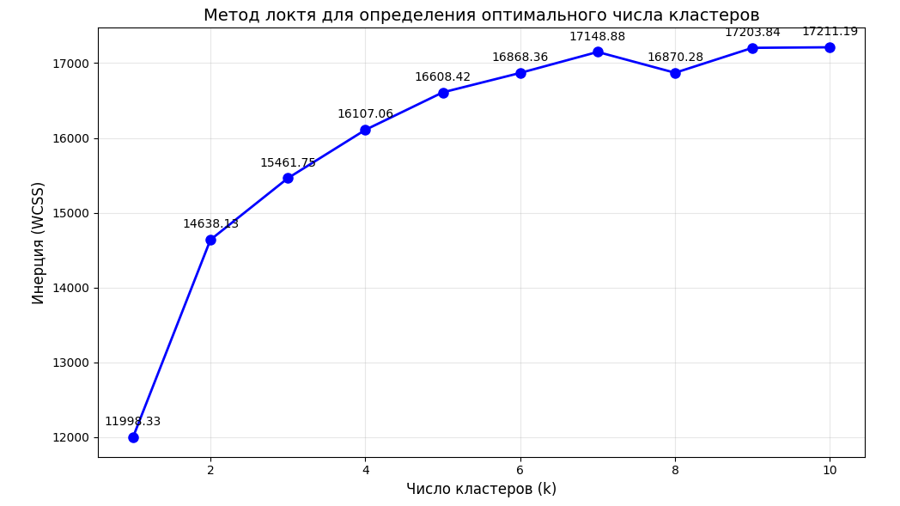

# Анализ эффективности преобразований временных рядов для прогнозирования 

## 1. Цель работы

Исследовать влияние различных типов преобразований временных рядов на качество прогнозирования. В рамках работы решаются следующие задачи:
1.  Кластеризация временных рядов для выделения групп со схожей динамикой.
2.  Сравнение базовых статистических методов (Naive, Theta, ETS) с моделью машинного обучения (CatBoost).
3.  Оценка эффективности применения преобразований (`log1p`, `Box-Cox`, `differencing`) к целевому ряду для итогового прогноза.

## 2. Данные

Используется набор данных **M4-yearly**. Для ускорения экспериментов была взята выборка из 150 временных рядов, каждый длиной не менее 40 наблюдений. Длина окна признаков (`L`) — 35 лагов.

## 3. Кластеризация временных рядов

Для выявления групп рядов с похожим поведением применена кластеризация методом `TimeSeriesKMeans` с метрикой `soft-DTW`.

*   **Метод определения числа кластеров:** Метод локтя.
*   **Результат:** Оптимальным числом кластеров выбрано **k = 7**.

### 3.1. Характеристика полученных кластеров

Визуальный анализ рядов внутри каждого кластера позволил выделить следующие типы динамики:

*   **Кластеры 1, 2, 3, 5:** Ряды с выраженным трендом.
*   **Кластеры 0, 4, 6:** Ряды с высокой волатильностью и хаотичным поведением.

*Рис. 1. Визуализация определения оптимального числа кластеров.*

## 4. Модели и Метрики

### 4.1. Бейзлайны
Для оценки качества прогнозов используются три простые статистические модели:
1.  **Naive forecast:** Прогноз равен последнему наблюдению.
2.  **Auto Theta:** Реализация метода Theta из библиотеки `sktime`.
3.  **Auto ETS:** Модель экспоненциального сглаживания из `statsmodels`.

### 4.2. Глобальная модель (CatBoost)
В качестве основной модели машинного обучения используется градиентный бустинг из библиотеки `catboost`. Признаками для модели служат 35 лагов целевого ряда и номер кластера, к которому относится ряд. Модель обучается отдельно для каждого кластера.

### 4.3. Метрики оценки
Качество прогнозов оценивается по трем метрикам:
*   **SMAPE** (Symmetric Mean Absolute Percentage Error) — основная метрика.
*   **MAE** (Mean Absolute Error).
*   **RMSE** (Root Mean Square Error).

### 4.4. Конвейер преобразований (Transformations Pipeline)
Для эксперимента были реализованы следующие преобразования целевой переменной:

| Преобразование | Описание |
| :--- | :--- |
| **Исходный ряд (None)** | Модель обучается на немодифицированных данных. |
| **Log1pTransform** | Логарифмирование `log(1 + x)` для стабилизации дисперсии. При отрицательных значениях добавляется сдвиг. |
| **BoxCoxTransform** | Преобразование Бокса-Кокса для нормализации распределения и стабилизации дисперсии. При отрицательных значениях добавляется сдвиг. |
| **DiffTransform** | Взятие разности первого порядка для приведения ряда к стационарному виду. Прогнозы модели возвращаются к исходной шкале путем обратного интегрирования. |

## 5. Результаты экспериментов

В ходе экспериментов было проведено сравнение качества прогнозов модели CatBoost для каждого типа преобразования. Результаты сведены в таблицу ниже.

| Модель / Преобразование | SMAPE (средний) | MAE (средний) | RMSE (средний) | Комментарий |
| :--- | :--- | :--- | :--- | :--- |
| **Naive (бейзлайн)** | 23.48 | — | — | Базовый уровень. |
| **Theta (бейзлайн)** | 22.15 | — | — |  |
| **ETS (бейзлайн)** | 21.90 | — | — |  |
| **CatBoost (None)** | 3.72 | 138.15 | 162.35 | Сильная базовая линия. |
| **CatBoost (Log1p)** | **2.50** | 121.20 | 151.01 | Наилучший результат в среднем. |
| **CatBoost (Box-Cox)** | 3.91 | 180.40 | 210.55 | Результат хуже Log1p из-за нестабильности. |
| **CatBoost (Differencing)** | 4.09 | 163.67 | 192.76 | Работает хуже на волатильных рядах. |

### 5.1. Анализ эффективности преобразований по кластерам

Эффективность преобразований сильно зависит от типа временного ряда.

*   **Кластеры с трендом (0, 1, 2, 3):**
    *   **Наилучшее преобразование:** `None` или `Log1p`.
    *   **Вывод:** Для стабильных рядов сложные преобразования не дают значимого преимущества.

*   **Кластеры с высокой волатильностью (4 и 6):**
    *   **Наилучшее преобразование:** `Log1p`.
    *   **Вывод:** Логарифмирование критически важно для стабилизации дисперсии и "сжатия" выбросов, что позволяет модели лучше обучаться.

*   **Кластер со сложной динамикой (5):**
    *   **Наилучшее преобразование:** `None` или `Differencing`.
    *   **Вывод:** Для рядов, где тренд не является строго линейным, приведение к стационарности с помощью взятия разности может быть полезным, но требует осторожности.

### 5.2. Проблемы преобразований

*   **Box-Cox:** Показал нестабильность при обратном преобразовании для рядов с экстремальными значениями.
*   **Differencing:** Накопление ошибки при обратном интегрировании приводит к ухудшению качества на волатильных рядах.

## 6. Выводы и рекомендации

1.  **Кластеризация полезна:** Разделение рядов на кластеры и обучение отдельных моделей для каждого из них позволяет лучше учитывать специфику различных типов динамики.

2.  **CatBoost vs Бейзлайны:** Модель градиентного бустинга (CatBoost) значительно превосходит по качеству простые статистические методы (Naïve, Theta, ETS) на данном наборе данных.

3.  **Выбор преобразования зависит от типа ряда:**
    *   Для рядов с **умеренным трендом и низким шумом** модель хорошо работает на исходных данных.
    *   Для рядов с **высокой волатильностью** применение **log1p-преобразования** является наиболее эффективным способом улучшить качество прогноза.
    *   Преобразование Бокса-Кокса (`Box-Cox`) показывает результаты, близкие к `log1p`, но не дает систематического преимущества и может быть нестабильным.
    *   Взятие разности (`differencing`) может быть полезно для рядов со сложной динамикой, но в среднем по всем кластерам показывает себя хуже из-за нестабильности на волатильных рядах.

**Итоговая рекомендация:** В качестве стандартного пайплайна предобработки рекомендуется использовать **log1p-преобразование**, как наиболее эффективный метод.